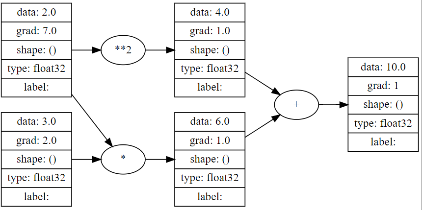

# atomgrad


Atomgrad is a simple autograd engine that aims to be between [micrograd](https://github.com/karpathy/micrograd/) and [tinygrad](https://github.com/tinygrad/tinygrad) that performs autodiff on vector-valued and scalar-valued functions and has a neural networks lib on top of it. Like a mini version of PyTorch for educational and practise.

## Features

- Supports Pytorch-like vector-valued and scalar-valued ops.
- Supports basic unary ops, binary ops, reduce ops and movement ops i.e (activn funcs, `sum`, `exp`, `reshape`, etc).
- Supports activation functions such as `relu`, `sigmoid`, `tanh`, etc.
- Supports softmax and binary cross entropy.
- Supports Graph Viz. 

## Installation

You can install atomgrad using pip:

```bash
pip install atomgrad==0.2.5
```

## Usage

Here is a simple example of using atomgrad to compute the gradient of a function:

```python
from atomgrad.atom import Atom
from atomgrad.graph import draw_dot


# create two tensors with gradients enabled
x = Atom(2.0, requires_grad=True)
y = Atom(3.0, requires_grad=True)

# define a function
z = x * y + x ** 2

# compute the backward pass
z.backward()

# print the gradients
print(x.grad) # 7.0
print(y.grad) # 2.0

draw_dot(z)
```


Here is a simple example of using atomgrad to train a neural network:

```python
import numpy as np
from atomgrad.atom import Atom
from atomgrad.nn import AtomNet, Layer
from atomgrad.optim import SGD
from atomgrad.metrics import binary_cross_entropy, accuracy_val

# create a model
model = AtomNet(
  Layer(2, 16),
  Layer(16, 16),
  Layer(16, 1)
)
# create an optimizer
optim = SGD(model.parameters(), lr=0.01)

# load some data
x = [[2.0, 3.0, -1.0],
  [3.0, -1.0, 0.5],
  [0.5, 1.0, 1.0],
  [1.0, 1.0, -1.0],
  [0.0, 4.0, 0.5],
  [3.0, -1.0, 0.5]]
y = [1, 1, 0, 1, 0, 1]

x = Atom(x)
y = Atom(y)

model.fit(x, y, optim, binary_cross_entropy, accuracy_val, epochs=100)
```

## Demos

An example of simple autodiff and two binary classifiers using a neural net with a 16 node hidden layer network is in the `demos.ipynb` notebook.


